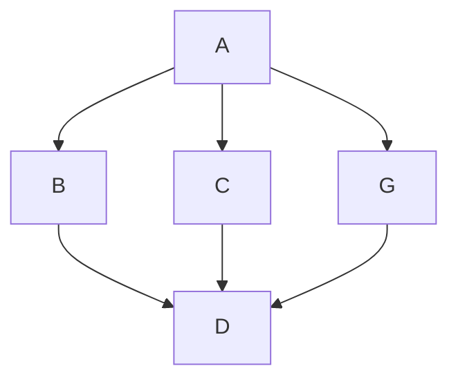

<!-- Formating Docs -->
<!-- https://docs.github.com/en/get-started/writing-on-github/getting-started-with-writing-and-formatting-on-github/basic-writing-and-formatting-syntax -->
# Niklas Fischer Portfolio

This page contains a preview of all my projects, click the name of the project to see my contributions!

# Games
## [***Florida Man On The Run***](FloridaManOnTheRun#florida-man-on-the-run)


```
Game      : Florida Man On The Run!
Role      : Gameplay Programmer, Project Manager, Producer
When      : 2025 december - 2026 januari
Developer : School Project
Engine    : Unity
Team Size : 6

Game pitch and idea by me. 
Inspired by very old games like TonyHawk Pro skateboarder and other extream sport games. 
Made within the restrictions of a small team and a couple of weeks.
Primary programming role, character controller, using a state machine and an input wrapper.
Small art and level tools, camera parallax, tutorial promts and triggers, 
camera shake, score manager and score UI.
2D animation integration.

```
> [!NOTE]
>[***Read more about Florida Man On The Run***](FloridaManOnTheRun#florida-man-on-the-run)
## [*Florida Man On The Run*](FloridaManOnTheRun#florida-man-on-the-run) ← Click here for more info!
[X - Itch Link](https://yrgo-game-creator.itch.io/florida-man-on-the-run)

---

## [***Pale Reflections***](PaleReflections#pale-reflections)


```
Game      : Pale Reflections
Role      : Gameplay Programmer, AI implementation, working with character artist regarding workflow
When      : 2026 march - 2026 june
Developer : School Project
Engine    : Unreal Engine
Team Size : 6 people

My primary role was makeing the AI enemy, and the roof enemy behave for our stealth/Horror game.
AI states using bluprints and the different Unreal Engine tools for pathfinding and behaviors.
Blood camera shader using their node material system.
Roof Cave in particle systems and trigger events.
Particle systems for vial explotions.

```
> [!NOTE]
>[***Read more about Florida Man On The Run***](FloridaManOnTheRun#florida-man-on-the-run)
## [*Pale Reflections*](PaleReflections#pale-reflections) ← Click here for more info!
[X - Itch Link](https://yrgo.itch.io/pale-reflections)

---
## [***Mobile Game***](MobileGame#mobile-game) ← Click here for more info!


```
Game      : Mobile Game
Role      : Gameplay Programmer/ Designer ect
When      : 2026 januari - 2026 februari
Developer : School Project
Engine    : Unity

Solo school assigment to do a mobile game.
I focosued on the player control feel and getting the custom produceral level generator to be controllable.
So random but with a ordered flow of possible challanges.
Built a pooling system, and a custom level chunk structure within prefabs. 
Data objects primarly holding information about what objects to ask the pooling system for.
Using scriptable objects and lots of objects talking to eachother.
Player controller using primarly physics casts (raycast and capsule casts), 
a player state machine, swipe input handling and a modular powerups system that ties into the UI.
A inverted game where the camera never moves but the world scrolls past using a central game manager.
Curve World shader using shader graph.
Highscore saving to Firebase Database.

```
## [*Mobile Game*](MobileGame#mobile-game) ← Click here for more info!

---

## [***Template-Name***](NameOfProject#name-of-project) ← Click here for more info!


```
Game      : Game Name!
Role      : Gameplay Programmer,
When      : 2025 december - 2026 januari
Developer : Developer Name
Engine    : Unity
```
## [*Template-Name*](NameOfProject#name-of-project) ← Click here for more info!
[X - Itch Link](https://yrgo-game-creator.itch.io/xxxTEMPLATExxx)

---


### Test
